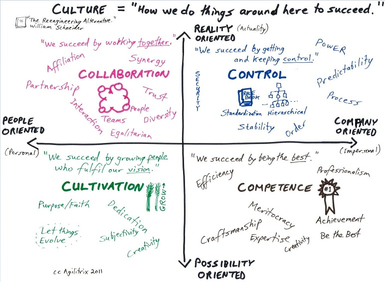

# Модель принятия решений
 [Флип](https://photos.google.com/share/AF1QipM4blkk7aW1gCjKYsEJj9SngPxhdPRNcHanggVbgCugKyTkRUGb0GnsyxTu_I1Bqg/photo/AF1QipPxNqiYUBSl9BEdD1GIpQNt6ou5FXb01At_gOB8?key=TUNISk5qSkVvaHdia1p0aXNSSHN0YTByMzl0cEp3) 

- Бизнес модель
  - Устойчивый или развивающийся бизнес?
  - Поиск или масштабирование?
  - Новый продукт или копия существующего?
  - Инвестиции или собственные средства?
- Модель процессов
  - Как организованы команды?
    - Функциональные колодцы или кросс-функциональные команды
  - Как принимаются решения?
    - Единолично или командно
  - Целеполагание
    - Задача / Цель / Ценность
  - Кто несет ответственность?
    - Менеджер или участники команды
  - Циклы обратной связи?
    - Спонтанные или регулярные
  - Культура организации
    - [Schneider Model](https://www.youtube.com/watch?v=wIbCcfxzc2A)
    - 
- Модель требований
  - Функциональные (бизнес)
  - НФТ
    * Usability
    * Reliability
    * Availability
    * Portability
    * Testability
    * Scalability
    * Flexibility
    * Reusability
    * Maintainability
    * Supportability
    * Interoperability
    * Performance
    * Security
  - CAP теорема
    - Consistency, Availability, Partition fault tolerance
      - Одновременно можно достигнуть только 2
- Модель дизайна
  - Архитектура
  - Дизайн классов
- Модель реализации
  - Как написать код
  
Любое решение на более низком уровне обсусловлено решением на более высоком уровне.
— Кто решает как строить архитектуру приложения? — В конечном итоге бизнес.
— Кто решает писать тесты или нет? — В конечном итоге бизнес.

Вам нужно уметь обосновываать любое вашем техническое решение бизнес необходимостью. Если вы этого не можете делать, возможно вы приняли неверное решение.